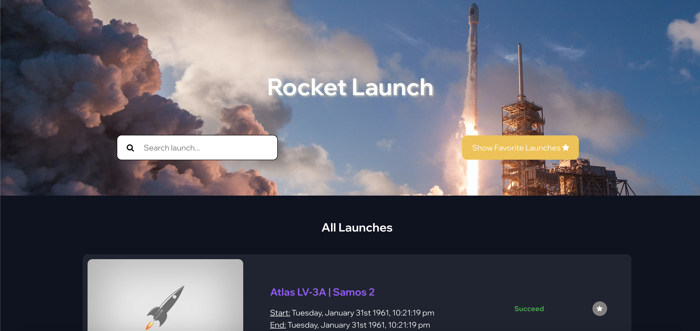
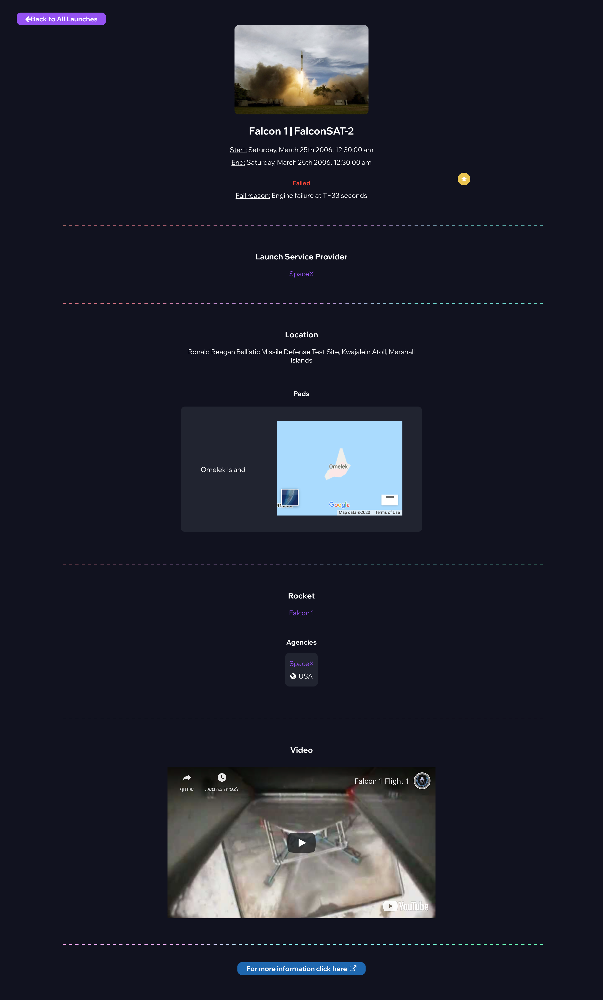
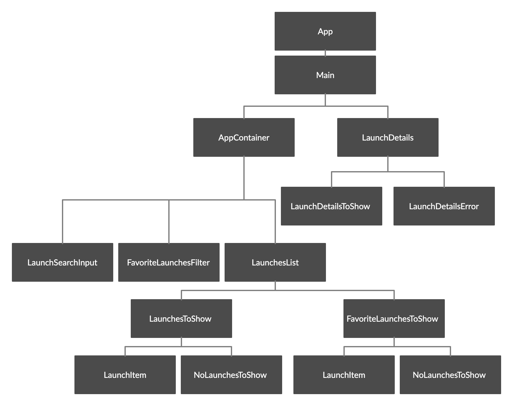

<h1 align="center">Rocket Launch</h1>

<p align="center">
  


</p>

<p align="center">
</p>

<h2 align="center"><a  href="https://rocket-launch.netlify.app">Live Demo</a></h2>

## Description

<p align="center">

</p>

Rocket Launch is a web app for browsing rockets launches from around the world. 
The app is a pure client-side app, there is no server side. 
The data comes from API calls to launch-library (https://launchlibrary.net/docs/1.4/api.html).

## Features

### Search launch by name

- Start typing the launch name or part its name in the form on the left corner of the screen.
- Scroll down the results to find the wanted launch.

<p align="center">
</p>

### Add launches to your Favorite Launches List

- Click on the star icon to add a launch to your favorites. 
You can find the star icon on the launch item in the launches list, or on the launch details page.
- To see your Favorite Launches List, click on the "Show Favorite Launches" button.
- If you want to remove a launch from your favorites, click on the star icon again. 

<p align="center">
</p>

### View launch details

- Choose a specific launch and click on its name.
- View the launch details page including details like Agency details, Rocket details, Location, Missions, Video, etc.
- To go back to All Launches List, click on the "Back to All Launches" button on the left corner of the page.

<p align="center">

</p>

## Technologies used in the project

### React.js

- The project was created with create-react-app.
- I used **React** (with **Hooks**) for fast and dynamic components.
- State management is done with React **Context**, for easy and simple state management.

### Sass

- Each and every component is styled with **Sass** (CSS preprocessor for a more modular and easier to maintain CSS code). 
- Some components also use **Material-UI** in some places.

### Axios

- the project concentrates on the client side.
- I used Axios library to send asynchronous HTTP requests to a REST endpoint - launch-library API.

# Architecture

## **Main Components**

<p align="center">

</p>

### Components
- All of my components (other than the <App /> component) are in the "components" folder. 
- Each significant component and its children have their own folder (e.g <LaunchesList /> and <FavoriteLaunchesToShow /> are both placed in “src/LaunchesList.js”).
- Common: common components (that are being used in a few different components).

### Hooks
- useLaunchSearch – A hook that makes the API call in order to receive relevant data according to the user's query/page number. In the useLaunchSearch I added the ability to run the name search on the favorite launches list as well. The hook passes all its' data to the launches context in the "context" folder. 
- useLocalStorage – A hook that saves favorite launch items easily in the browser's local storage.

### Context
- launches.js – In this file I'm using <React.Context /> to provide launches details for inner, deeper components of my app. For instance, the <AddToFavoriteButton /> component uses setFavoriteLaunchesList prop, without having to pass it all the way down from the <Main /> component.

### Utilities
- _variables.scss – Scss global variables file.
- helper_function.js – A file that contains a function that checks if a string is a valid URL.

### API calls
- In useLaunchSearch hook- I use axios to receive the launches list according to the user's query/page number.
- In <LaunchDetails /> component- An API call to fetch the launch object with the certain id that the user clicked on or wrote in the URL. If a user types something that is not a valid launch id, he'll be routed back to the home page.


# Project setup

```
yarn install
yarn start
```

## Available Scripts

In the project directory, you can run:

### `yarn start`

Runs the app in the development mode.<br />
Open [http://localhost:3000](http://localhost:3000) to view it in the browser.

The page will reload if you make edits.<br />
You will also see any lint errors in the console.

### `yarn test`

Launches the test runner in the interactive watch mode.<br />
See the section about [running tests](https://facebook.github.io/create-react-app/docs/running-tests) for more information.

### `yarn build`

Builds the app for production to the `build` folder.<br />
It correctly bundles React in production mode and optimizes the build for the best performance.

The build is minified and the filenames include the hashes.<br />
Your app is ready to be deployed!

See the section about [deployment](https://facebook.github.io/create-react-app/docs/deployment) for more information.

### `yarn eject`

**Note: this is a one-way operation. Once you `eject`, you can’t go back!**

If you aren’t satisfied with the build tool and configuration choices, you can `eject` at any time. This command will remove the single build dependency from your project.

Instead, it will copy all the configuration files and the transitive dependencies (Webpack, Babel, ESLint, etc) right into your project so you have full control over them. All of the commands except `eject` will still work, but they will point to the copied scripts so you can tweak them. At this point you’re on your own.

You don’t have to ever use `eject`. The curated feature set is suitable for small and middle deployments, and you shouldn’t feel obligated to use this feature. However we understand that this tool wouldn’t be useful if you couldn’t customize it when you are ready for it.

## Learn More

You can learn more in the [Create React App documentation](https://facebook.github.io/create-react-app/docs/getting-started).

To learn React, check out the [React documentation](https://reactjs.org/).

### Code Splitting

This section has moved here: https://facebook.github.io/create-react-app/docs/code-splitting

### Analyzing the Bundle Size

This section has moved here: https://facebook.github.io/create-react-app/docs/analyzing-the-bundle-size

### Making a Progressive Web App

This section has moved here: https://facebook.github.io/create-react-app/docs/making-a-progressive-web-app

### Advanced Configuration

This section has moved here: https://facebook.github.io/create-react-app/docs/advanced-configuration

### Deployment

This section has moved here: https://facebook.github.io/create-react-app/docs/deployment

### `yarn build` fails to minify

This section has moved here: https://facebook.github.io/create-react-app/docs/troubleshooting#npm-run-build-fails-to-minify


# Future scope

- Add authentication.
- More filters and sort options.

